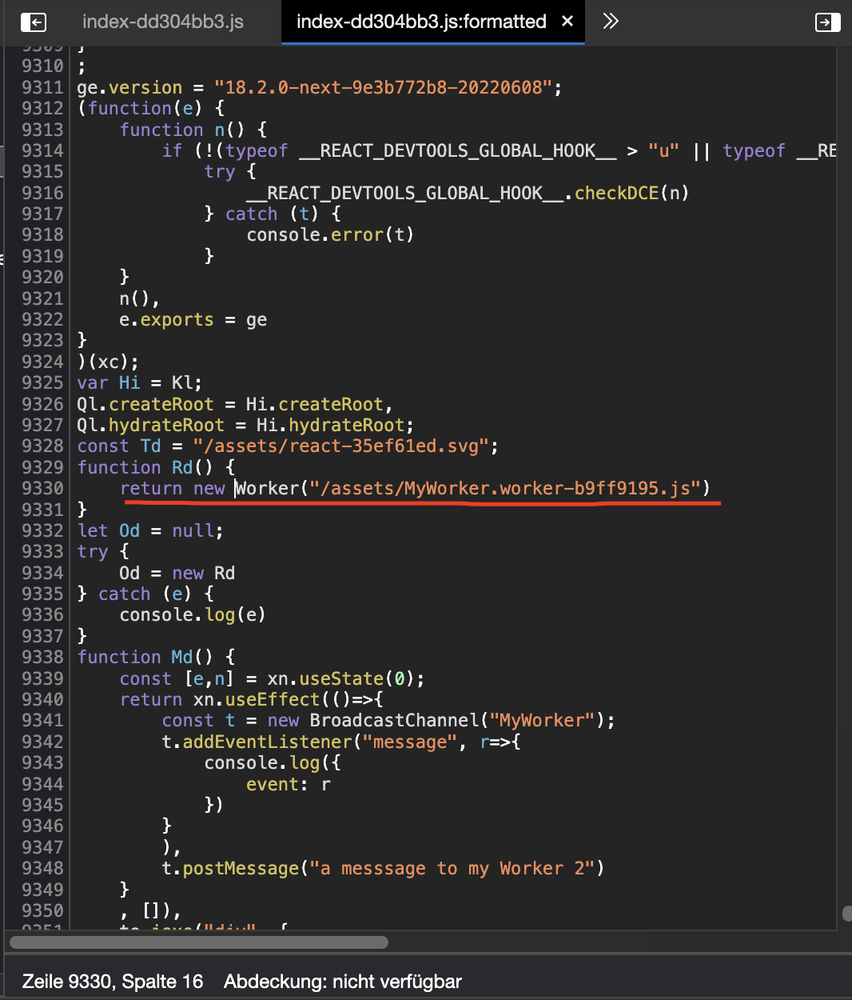

this repo tries to show a bug in how vite (or rollup) handles web-worker
when using watch-mode on build.

## How-To

* run `yarn watch`
* start a server (`npx serve dist`)
* load project in browser
* make a change in code-base or trigger a rebuild otherwise while in watch-mode
* reload project in browser
* observe the error (see images below)

Web Worker works correctly:

Web Worker got lost:
